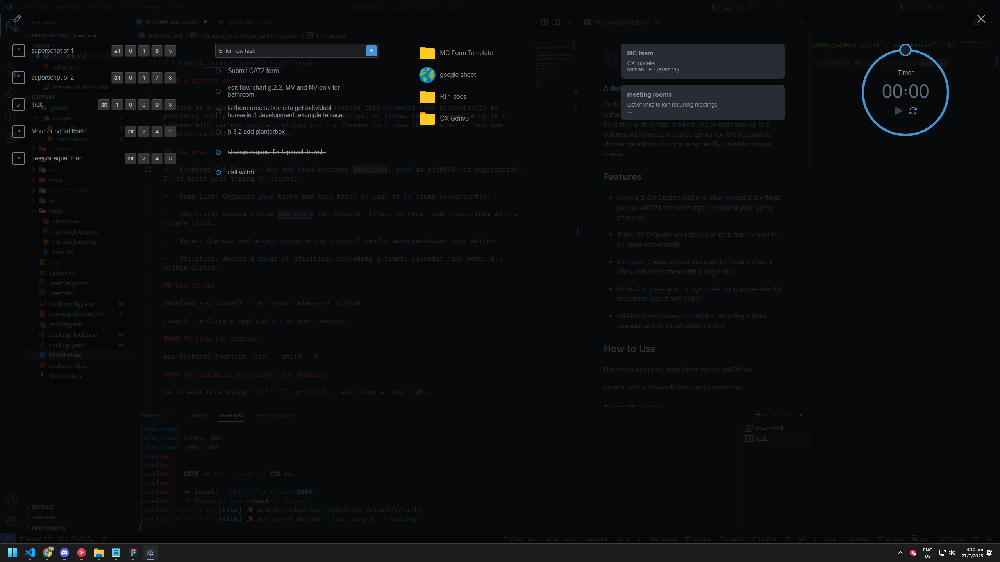

#  Curtain

#### A desktop overlay app

Curtain is a versatile desktop overlay application that enhances your productivity by providing multiple modules right at your fingertips. It allows you to customize up to 5 columns with various modules, giving you the freedom to choose the information you want readily available on your screen.

## Features

-   Keyboard Cut Display: Add and View keyboard shortcuts, such as alt0178 for superscript 2, to boost your typing efficiency.

-   Todo List: Organize your tasks and keep track of your to-do items conveniently.

-   Shortcuts: Create custom shortcuts for folders, files, or URLs, and access them with a single click.

-   Notes: Compose and manage notes using a user-friendly markdown-based note editor.

-   Utilities: Access a range of utilities, including a timer, calendar, and more, all within Curtain.

## Screenshot



## How to Use

Download and install from latest release on GitHub.

Launch the Curtain application on your desktop.

#### To show the overlay

use keyboard shortcut `ctrl` `shift` `D`

#### To customize the columns and modules:

Go to edit mode using `ctrl` `E` or click on edit icon at top right.

Select the number of columns to be shown.

In each column choose the modules in the dropdown.

Now, enjoy the productivity boost with your personalized Curtain overlay on your desktop.

## Development

```bash
#run electron
npm run dev

#run electron in electronmon
npm run devmon
```

## Building

```bash
npm run build
```

## License

Curtain is released under the [MIT License](https://github.com/merhmerh/curtain/blob/main/LICENSE). Feel free to use, modify, and distribute the app following the terms of the license.
